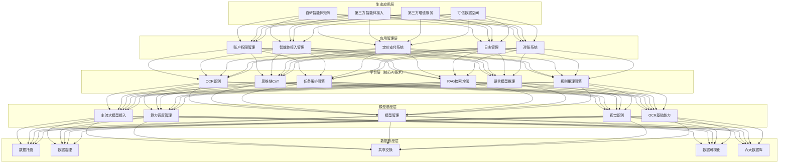

# CaiYi Agent Platform

> 全国首个公共采购智能体协同管理平台 — 技术方案与架构设计

## 🔗 官方网站

**[http://www.caiyigaoke.cn/](http://www.caiyigaoke.cn/)** — 彩翼公共采购智能体协同管理平台官方网站

> 微信公众号：**彩翼公共采购智能体协同管理平台** | [公众号文章精选](docs/articles/README.md)

---

**技术栈：** Multi-Agent · LLM+RAG · Function Call · Workflow Orchestration · Knowledge Graph · LangChain · PyTorch · Milvus · Neo4j · 国产算力适配

---

## 项目定位

**彩翼公共采购智能体协同管理平台**（简称"彩翼平台"）是由广州市政府采购中心（广州交易集团旗下）依托**彩翼人工智能联合实验室**自主建设的大模型应用平台，于 **2025年4月8日正式上线**，是全国首个面向公共采购全流程的智能体协同管理平台。

平台以"AI+公共采购"为核心技术路径，通过构建覆盖采购全流程的智能体协同管理生态，深度解决政府采购领域信息孤岛、合规审查繁琐、效率低下等行业痛点，赋能**监管部门、采购人、代理机构、供应商**四类主体提质增效。

平台业内首创"公共采购智能体协同管理"概念，打破传统单点智能工具的建设思路，建立适配公共采购行业特性的智能体协同理论框架与全流程实践体系，填补了公共采购领域智能体协同管理的理论空白。

---

## 核心亮点

### 亮点一：国资场景深度适配，国有平台官方背书

作为广州市唯一的集中采购代理机构旗下平台，彩翼平台天然拥有真实、海量的公共采购场景与数据积累，具备其他商业平台无法复制的国有资源壁垒和官方背书。平台由广州市政府采购中心牵头打造，背靠广州交易集团，在政府采购这一强监管、高合规要求的行业，国资背景具备极强的官方信用背书。

### 亮点二：27个智能体全场景覆盖，六大核心功能模块

平台规划总计 **27个智能体模块**，按照**事前防控、事中协同、事后追溯**全业务周期布局，覆盖采购文件、投标服务、评审监管、综合业务、专项服务五大类。目前已上线 **13款智能体**，覆盖采购全高频场景。

平台设置六大核心功能，实现采购场景端到端智能化覆盖：
1. **自研智能体应用支撑** — 为自研智能体提供国产算力部署、模型算法研发、智能体调度等应用服务支撑
2. **第三方智能体接入服务** — 创新性构建智能体准入标准，支持第三方智能体无缝接入，五级审核全生命周期管控
3. **生态级服务聚合门户** — 深度整合第三方智慧解决方案，构建"数据-工具-场景"一体化资源池
4. **可信数据空间** — 基于区块链技术搭建智能体间数据交换网络，实现跨部门数据安全确权与按需共享
5. **交易系统SaaS服务** — 集成自研公共采购交易系统，面向各采购代理机构提供SaaS服务，打造远程评审节点
6. **异构算力聚合调度** — 聚合算力资源（含国产算力），通过精准匹配与资源优化算法，提升算力利用率并降低运营成本

### 亮点三：开放生态构建，公共采购领域首个智能体应用市场

创新性建立第三方智能体准入标准，支持公共采购领域外部智能体无缝接入，构建"平台底层+生态应用"双轮驱动模式。已与全国 **26家单位**签署战略合作协议，联合 **30余家机构**共建采购行业智能体应用生态联盟。

### 亮点四：全链路国产算力适配，信创合规

平台深度对接国产芯片算力架构，从算力层、模型层到应用层实现全链路自主可控，完全契合信创改造要求。支持国产开源RISC-V算力部署、DeepSeek/九州等国产大模型，所有底层技术成果归广州市政府采购中心所有，知识产权权属清晰。

---

## 系统架构

平台采用**五层架构设计**，自下而上分为数据基座层、模型基座层、平台层、应用管理层、生态应用层，同时汇聚**数据、算力、智能体、应用场景**四大核心要素，构建完整的公共采购AI服务体系。

**四大聚合能力**：平台实现智能体聚合、算力聚合、数据聚合、场景聚合，上接技术提供方，下联需求端，形成完整的产业生态闭环。

详见：[docs/architecture.md](docs/architecture.md)

---

## 智能体矩阵

平台规划总计 **27个智能体模块**，按业务周期分为五大类。目前已上线/开发中 **13款智能体**，其余按优先级梯次推进。

### 已上线智能体（13款）

| 编号 | 智能体名称 | 开发方 | 阶段 | 完成率 | 目标群体 | 采购阶段 |
|------|-----------|--------|------|--------|---------|---------|
| 1 | 采购文件辅助编制智能体 | 沃云 | 已上线 | 70% | 采购人、代理机构 | 招标 |
| 2 | 采购项目审计（稽核）智能体（串围标+采购文件审查） | 沃云 | 测试验收 | 70% | 采购人、代理机构、监管单位 | 定标 |
| 3 | 采购需求调查智能体 | 沃云 | 测试验收 | 70% | 采购人、代理机构 | 招标 |
| 4 | 询价比价智能体 | 沃云 | 需求评估 | 70% | 采购人、代理机构 | 招标 |
| 5 | 框采批采比价智能体 | 沃云 | 需求评估 | 70% | 采购人、代理机构、监管单位 | 监管 |
| 6 | 采购文件合规检测智能体 | 南方 | 已上线 | 80% | 采购人、代理机构、监管单位 | 招标 |
| 7 | 预算审查智能体 | 南方 | 已上线 | 80% | 采购人、代理机构、监管单位 | 招标 |
| 8 | 合同审查智能体 | 南方 | 测试验收 | 80% | 采购人、代理机构、监管单位 | 定标 |
| 9 | 质疑回复处理智能体 | 南方 | 已上线 | 80% | 采购人、代理机构、监管单位 | 监管 |
| 10 | 投标合规检测智能体（审查） | 南方 | 已上线 | 50% | 采购人、代理机构、监管单位 | 投标 |
| 11 | 投标合规检测智能体（模拟评审） | 南方 | 已上线 | 50% | 采购人、代理机构、监管单位 | 投标 |
| 12 | 辅助评审智能体（模拟评审） | 南方 | 规划中 | 10% | 采购人、代理机构、监管单位 | 开标和评标 |
| 13 | 智能咨询助手 | 南方 | 已上线 | 90% | 全主体 | 全过程 |

### 按业务周期分类（27个规划）

| 类别 | 智能体 | 阶段 |
|------|--------|------|
| **采购文件类** | 采购需求调查、文件编制、文件合规检测 | 已上线/开发中 |
| **投标服务类** | 投标文件编制、投标合规检测、模拟评审 | 已上线/开发中 |
| **评审监管类** | 辅助评审、评审结果审查、评审异常分析、围串标风险审查 | 部分上线/规划中 |
| **综合业务类** | 质疑回复、政策智能咨询、预算申报表审查、合同审查 | 已上线/开发中 |
| **专项服务类** | 家具比价、AI购物助手、商品上架初审、价格巡检 | 已上线一期 |

### 对标国家发改委20类重点场景

平台智能体矩阵全面对标《关于加快招标投标领域人工智能推广应用的实施意见》（发改法规〔2026〕195号）提出的20类重点场景，覆盖招标策划、招标文件编制、招标文件检测、投标策划、投标合规自查、开标、专家抽取、智能辅助评标、评标报告核验、辅助定标决策、中标合同签订、场所调度、见证管理、档案管理、智慧问答、专家管理、围串标识别、信用管理、协同监管、投诉处理全场景。

详见：[docs/agent-matrix.md](docs/agent-matrix.md)

---

## 核心技术方案

### 1. L1-L4任务分层路由引擎

针对公共采购场景任务复杂度差异大的特点，设计L1-L4四级任务分层路由机制：

| 层级 | 任务类型 | 执行方式 | 典型场景 |
|------|---------|---------|---------|
| **L1** | 单轮知识问答 | RAG直接回答 | 政策咨询、法规查询 |
| **L2** | 单Agent+工具调用 | 单Agent+Function Call | 合规检测、文件审查 |
| **L3** | 多Agent串行协作 | 多Agent流水线 | 文件编制+合规审查+修改建议 |
| **L4** | 全流程编排 | Workflow+人工节点 | 完整采购项目全流程 |

路由引擎基于意图分类（规则白名单+小模型分类）+复杂度评估（工具数/文档数/是否需人工/是否跨系统）进行层级判定，并支持降级回退策略。

详见：[docs/task-routing.md](docs/task-routing.md) | 代码：[code-snippets/agent_router.py](code-snippets/agent_router.py)

### 2. Milvus+Neo4j双引擎RAG系统

构建10万+法规文档的RAG检索系统，采用向量检索+知识图谱双路召回：

- **Milvus向量检索**：HNSW索引，领域微调Embedding模型，标量过滤（部门/时间/法规层级/文件类型）
- **Neo4j知识图谱**：法规实体关系遍历（引用链路）、品目-法规适用关系查询、风险规则推理
- **融合重排**：final_score = 0.6 × vector_score + 0.4 × graph_score
- **合规校验过滤**：时效性校验（已废止/修订）、适用范围校验（项目类型/金额/地区）

详见：[docs/rag-pipeline.md](docs/rag-pipeline.md) | 代码：[code-snippets/rag_retrieval.py](code-snippets/rag_retrieval.py)

### 3. 采购场景Function Call工具体系

定义7大类采购场景专用工具，支持Agent通过Function Call调用：

| 工具类别 | 代表工具 | 说明 |
|---------|---------|------|
| 合规审查类 | check_compliance、check_exclusive_clause | 采购文件合规审查、排他性条款检测 |
| 文件生成类 | generate_procurement_doc、generate_question_reply | 采购文件生成、质疑回复函生成 |
| 检索查询类 | search_regulations、query_supplier_info | 法规检索、供应商信息查询 |
| 风险检测类 | detect_bid_rigging | 围串标风险检测 |
| 数据查询类 | query_price_benchmark、query_history_cases | 价格基准查询、历史案例查询 |
| 流程控制类 | create_workflow、approve_node | 工作流创建、审批节点 |
| 报告生成类 | generate_compliance_report、generate_witness_report | 合规报告生成、见证报告生成 |

详见：[code-snippets/function_call_defs.py](code-snippets/function_call_defs.py)

### 4. 多维内容质量评分体系

对Agent生成的采购文件进行四维质量评估，根据综合评分定级S/A/B/C，C级自动触发人工复审：

| 维度 | 权重 | 评估内容 |
|------|------|---------|
| **合规性** | 35% | 法规匹配度、排他性条款检测、政策偏差识别、格式合规 |
| **完整性** | 25% | 必备条款覆盖、关键信息完整度、逻辑一致性 |
| **复用性** | 25% | 与历史优质文件相似度、标准模板匹配度、模块化程度 |
| **适配性** | 20% | 项目类型适配、品目特性适配、预算规模适配、地区政策适配 |

详见：[code-snippets/quality_scoring.py](code-snippets/quality_scoring.py)

### 5. 第三方智能体五级审核机制

创新性构建智能体准入标准，从准入标准、审核流程、运行监管、事后追溯四个维度建立全生命周期管控体系：

1. **供应商资质审核** — 工商资质、行政处罚记录核查
2. **技术初审** — 智能体架构、接口兼容性、运行稳定性、数据加密能力
3. **合规复审** — 对照法律法规，核查业务逻辑、输出内容是否符合采购规范
4. **场景实测** — 在真实采购业务环境中全流程模拟运行
5. **上线试运行** — 设置观察周期，动态监测运行状态

智能体上线后，平台实时监控调用频次、数据流向、内容输出、权限使用情况，一旦检测到违规自动触发预警，并执行权限限制、临时下线、强制停用等处置措施。

详见：[docs/architecture.md](docs/architecture.md)

### 6. 长流程上下文衰减处理

针对采购全流程长任务（L3/L4级）中LLM上下文窗口有限、长流程信息衰减问题，设计分层摘要+滑动窗口机制：

- **分层摘要**：每个Agent节点输出结构化摘要（关键决策/中间结果/待办事项），而非传递完整上下文
- **滑动窗口**：只保留最近N轮的完整对话历史，更早的历史压缩为摘要
- **状态同步**：通过共享状态存储（Redis/数据库）实现跨Agent状态同步
- **断点续跑**：长流程支持检查点（checkpoint）机制，失败后可从最近检查点恢复

详见：[docs/exception-handling.md](docs/exception-handling.md)

---

## 数据治理

### 四大数据渠道

1. **内部业务数据** — 采购中心历史采购文件、投标文件、评审记录、质疑投诉案例、合同档案
2. **公开法规数据** — 国家法律法规、部门规章、地方性法规、规范性文件、政策解读
3. **第三方数据服务** — 广易查等第三方数据服务商提供的供应商信息、市场价格、行业数据
4. **生态联盟共享数据** — 26家战略合作单位按协议共享的样本数据、应用场景数据

### 六大数据库

1. **政策法规库** — 政府采购相关法律法规、部门规章、地方性法规、规范性文件（10万+文档）
2. **历史采购文件库** — 历年采购文件范本、优质文件、问题文件案例
3. **采购项目案例库** — 完整采购项目案例（需求→文件→评审→合同→履约）
4. **供应商库** — 供应商基本信息、资质信息、历史中标记录、信用评价
5. **产品价格基准库** — 各类品目的市场价格基准、历史成交价、价格趋势（含医疗、IT设备、家具等专项品类数据采集）
6. **质疑投诉案例库** — 历史质疑函、回复函、投诉处理决定、典型案例

### 数据治理六环节

数据采集 → 数据清洗 → 数据标注 → 数据结构化 → 数据质量评估 → 数据更新维护

平台可同时提供数据治理、数据标注、多模态数据训练、数据资产管理等定制化服务。

详见：[docs/data-governance.md](docs/data-governance.md)

---

## 知识产权

依托平台研发成果，累计取得以下知识产权：

### 软件著作权（6项）

| 序号 | 软件名称 | 状态 |
|------|---------|------|
| 1 | 公共采购智能体协同管理系统V1.0 | 已申报 |
| 2 | 政府采购智能体问答知识库管理系统V1.0 | 已申报 |
| 3 | 采购文件合规性自动检测系统软件V1.0 | 已申报 |
| 4 | 政府采购质疑回复函自动生成系统软件V1.0 | 已申报 |
| 5 | 公共采购标领域智能咨询问答系统软件V1.0 | 已申报 |
| 6 | 政府采购专家评审公正性溯源辅助评判系统V1.0 | **已下证** |

### 发明专利（4项，已完成撰写待申报）

1. 一种基于多知识库协同的智能咨询处理方法
2. 一种面向采购智能审查系统及方法
3. 一种基于大语言模型的采购质疑全流程智能处理方法及系统
4. 一种基于文本特征的政府采购质疑函自动回复方法

### 实用新型专利（2项，已申报）

1. 一种音频检测预警模组、多人评审监控系统及装置
2. 一种用于采购领域评审专家活动管理的智能便携胸牌

### 商标与版权

- **商标**：彩翼高科（图案+文字，3个，商标大类09/35/41/42）；广州市政府采购中心图案（2个，商标大类35/45）
- **版权**：广州市政府采购中心图形（已下证）
- **外观专利**：广州市政府采购中心图形

详见：[docs/intellectual-property.md](docs/intellectual-property.md)

---

## 获奖与荣誉

| 序号 | 奖项/荣誉 | 颁发机构 | 时间 |
|------|----------|---------|------|
| 1 | "金穗杯"工作创新大赛三等奖 | 广州市直属机关 | 2025 |
| 2 | 创新创业项目资金 | 广州市国资委 | 2025 |
| 3 | 公共资源交易科技成果大赛二等奖 | "公共采购" | 2025 |
| 4 | 人工智能（AI）应用示范单位 | 《中国招标》 | 2026 |
| 5 | 优化营商环境"揭榜挂帅"项目 | 广东省 | 2026 |
| 6 | 数据要素应用创新大赛决赛三等奖 | 中国信息协会 | 2026 |
| 7 | 广东省采购服务标准化技术委员会（GD/TC 121）秘书处单位 | 广东省 | 2026 |

平台作为广东省采购服务标准化技术委员会秘书处单位，将主导制定超10项国家及省级行业标准。

---

## 应用成效

自平台上线以来，采购文件错误率显著下降，服务质量与效率实现双跃升：

### 整体成效

| 指标 | 数据 |
|------|------|
| 涉及项目交易额 | 超10亿元 |
| 营业收入同比增长 | 10% |
| 采购成本同比节约 | 30% |
| 人均工作效率提升 | 300% |
| 无效投标率降低 | 35% |
| 战略合作单位 | 26家 |

### 核心智能体成效

**质疑回复智能体**：
- 处理时间从2-3个工作日缩短至1-2小时，效率提升90%以上
- 投诉率同比下降超200%
- 质疑案件升级为投诉比例从10%下降至5%
- 法规引用准确率从90%提升至98%
- 文书规范率从90%提升至100%
- 新员工培训周期缩短约50%

**采购文件合规检测智能体**：
- 招标文件错误率从10%降至1%以内
- 文件更正比例下降40%
- 采购文件合规风险发生率从行业平均10%降至1%以内

**智能咨询助手**：
- 累计解答问题超千个
- 好评率达90%以上

**投标合规检测智能体**：
- 供应商投标废标率从行业平均15%-20%降至5%以内
- 投标文件编制从3-5天压缩至3小时以内，核心人工工作量减少80%
- 综合提升供应商中标率30%以上

详见：[docs/achievements.md](docs/achievements.md)

---

## 生态合作

### 彩翼人工智能联合实验室

由广州市政府采购中心与**广东南方信息安全产业基地有限公司**联合打造，立足公共采购领域全链条数智化转型需求，构建"场景牵引-技术驱动-产业赋能"的产学研用闭环。

实验室三大研发支柱：
1. 面向公共采购全场景的系列智能体研发
2. 行业样本数据库建设（政策法规库、历史采购文件库、采购项目案例库、供应商库、产品库、质疑投诉案例库）
3. 数据治理及数据标注技术工具研发

实验室组织架构：双主任负责制、7人管理委员会、首席科学家+采购业务首席专家双牵头人、五大核心研发组别（自然语言处理、数据治理、知识图谱与推理引擎、采购业务建模、系统集成与测试）。

### 战略合作生态

- 与全国 **26家单位**签署战略合作协议（含各省市政府采购中心、公共资源交易中心、第三方代理机构）
- 联合 **30余家机构**举办大模型专题研讨会，共建采购行业智能体应用生态联盟
- 与广州市白云区智慧城市管理产业促进会签订智能体应用服务协议
- 与广州移动达成合作意向
- 为广州市公安局提供免费试用服务并签订备忘录
- 与20+家代理机构建立联系，部分已签署战略合作协议

### 四链融合生态

平台深度对接创新链、产业链、资金链、人才链"四链融合"，联动市属国企、科研院所、产业园区、创投机构四大主体，构建"创新引领、产业落地、资金赋能、人才支撑"的全链条协同生态。

---

## 商业模式

### 两大定价体系

#### 1. SaaS化标准化服务（核心轻量化模式）

客户可在平台直接开通账号充值使用、在线完成消费结算，分为订阅式、按次消费扣款两大细分形式：

**订阅式定价**：以功能模块、使用权限、账号数量、服务周期为核心定价维度，设置基础版、专业版、企业版三大梯度订阅档位。服务周期支持按月、按季度、按年开通，年付享专属梯度优惠。

**按次消费扣款定价**：以智能体调用次数、功能使用量为核心计价单位，采用"先充值、后使用、实时扣款"的结算模式。新用户享单次免费体验权益。

**SaaS方案示例**（98,000元/年）：

| 项目 | 内容 | 价格（元） |
|------|------|-----------|
| 软件基础定制开发 | 基于SaaS平台定制采购合规核心功能，配置账号 | 45,000 |
| 数据整理服务 | 采购数据、合规文件清洗、结构化处理 | 30,000 |
| 合规知识库构建 | 整合法律法规、单位内部制度，搭建专属知识库 | 10,000 |
| 账户管理 | 多账户、个性化权限管理（200个以内） | 8,000 |
| 云端算力服务 | 智能体运行、模型推理所需云端算力 | 5,000 |
| 培训与售后 | 线上培训+7×12小时技术支持 | 赠送 |

#### 2. 本地化部署项目制

适配有本地化部署、个性化功能改造、合规数据整理需求的政府机关、国企集团等核心客群，采用项目制全流程报价模式。定价核心逻辑为**成本加成+价值锚定双轨制**，报价方案明确拆分基础部署包、定制化功能开发模块、配套实施与运维服务模块三大板块。

### 资金流转机制

平台引入虚拟代币"**彩豆**"：
1. 用户充值（微信/支付宝/银联/企业网银）→ 平台银行资金池
2. 用户调用智能体/模型/数据服务 → 自动扣减彩豆
3. 开发者/渠道商分佣 → 按周期结算，提交增值税专用发票后提现
4. 开票管理 → 与金蝶业财系统打通，实现业财一体化

### 分阶段定价策略

试用阶段（免费体验）→ 共创迭代阶段（优质共创伙伴8折优惠，反馈-迭代-付费闭环）→ 商用推广阶段（订阅制+按次调用双模收费）

详见：[docs/business-model.md](docs/business-model.md)

---

## 核心代码片段

> 以下代码为脱敏后的核心逻辑片段，展示技术方案的实现思路，非完整生产代码。

| 文件 | 说明 |
|------|------|
| [agent_router.py](code-snippets/agent_router.py) | L1-L4任务分层路由引擎核心逻辑（意图分类+复杂度评估+降级回退） |
| [rag_retrieval.py](code-snippets/rag_retrieval.py) | Milvus+Neo4j双引擎RAG检索流程（查询预处理+双路召回+融合重排+合规校验） |
| [function_call_defs.py](code-snippets/function_call_defs.py) | 采购场景Function Call工具定义（7大类工具+注册表+执行器） |
| [quality_scoring.py](code-snippets/quality_scoring.py) | 多维内容质量评分体系（合规35%+完整25%+复用25%+适配20%，S/A/B/C四级） |

---

## 文档索引

| 文档 | 说明 |
|------|------|
| [docs/architecture.md](docs/architecture.md) | 五层架构详解 + 第三方智能体五级审核机制 + 四大聚合能力 |
| [docs/agent-matrix.md](docs/agent-matrix.md) | 27个智能体矩阵详细清单 + 20类重点场景对标 |
| [docs/task-routing.md](docs/task-routing.md) | L1-L4任务分层路由引擎设计 + 路由决策流程 + 性能指标 |
| [docs/rag-pipeline.md](docs/rag-pipeline.md) | Milvus+Neo4j双引擎RAG系统 + 6步检索流程 + 评测体系 + 4方案对比 |
| [docs/exception-handling.md](docs/exception-handling.md) | 长流程上下文衰减处理 + 分层摘要+滑动窗口 + 断点续跑 |
| [docs/data-governance.md](docs/data-governance.md) | 四大数据渠道 + 六大数据库 + 六环节治理流程 + 数据安全合规 |
| [docs/intellectual-property.md](docs/intellectual-property.md) | 6项软著 + 4项发明专利 + 2项实用新型 + 商标版权详细清单 |
| [docs/achievements.md](docs/achievements.md) | 应用成效量化数据 + 各智能体效果对比 + 获奖荣誉 |
| [docs/business-model.md](docs/business-model.md) | SaaS+项目制两大定价体系 + 彩豆资金流转 + 分阶段定价策略 |
| [docs/articles/README.md](docs/articles/README.md) | 📰 微信公众号文章精选（6篇技术文章整理） |

### 公众号文章精选

| 文章 | 核心主题 |
|------|---------|
| [3分钟搞定采购文件合规审查](docs/articles/01-compliance-review-3min.md) | 合规检测智能体功能介绍与应用价值 |
| [信息化项目专项合规检测标准](docs/articles/02-it-project-special-standard.md) | 增强版上新 — 信息化项目专项深审 |
| [货物类通用规则合规检测清单](docs/articles/03-goods-general-rules-checklist.md) | 货物类采购文件5大类30+项检测清单 |
| [广州AI+政府采购，12个智能体](docs/articles/04-guangzhou-ai-procurement-12agents.md) | 平台整体介绍，12个智能体部署情况 |
| [从需求到文件，合规写进每一个字](docs/articles/05-demand-to-document-compliance.md) | 需求调查→文件编制→合规检测全流程协同 |
| [CMA证书"一单一库"实时查验](docs/articles/06-cma-certificate-verification.md) | CMA证书真伪/状态/范围实时查验能力 |

---

## 架构图

| 图表 | 说明 |
|------|------|
| [diagrams/multi-agent-architecture.mmd](diagrams/multi-agent-architecture.mmd) | Multi-Agent整体架构图 |
| [diagrams/rag-pipeline.mmd](diagrams/rag-pipeline.mmd) | RAG检索流程图 |
| [diagrams/task-routing.mmd](diagrams/task-routing.mmd) | 任务路由决策图 |

---

## 关于本仓库

本仓库为项目技术方案与架构设计的公开文档，因政企项目数据安全与保密要求，不包含完整源码、训练数据和生产环境配置。核心代码片段已做脱敏处理，旨在展示架构设计能力与技术方案思路。

项目所有底层技术成果归**广州市政府采购中心**所有，知识产权权属清晰，无任何权属纠纷。

---

*Architecture design & technical documentation by Yuge Wu | 广州市政府采购中心 · 彩翼人工智能联合实验室*
