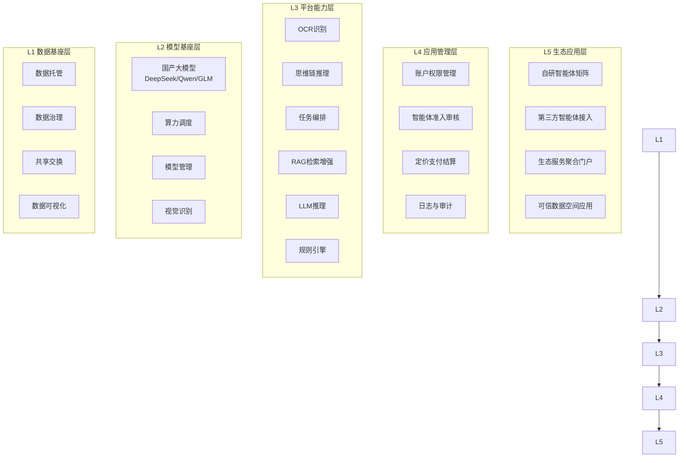
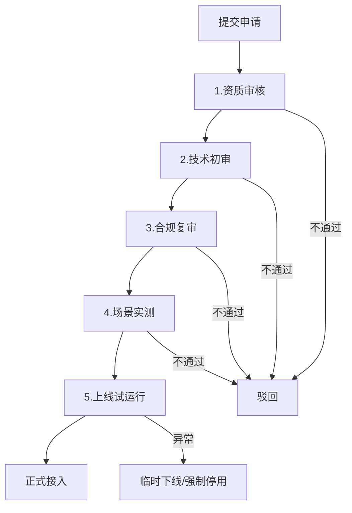

# 系统架构设计详解

## 架构总览

系统采用五层分层架构，自下而上分别为：

## 各层详细设计

### L1 数据基座层
- **数据托管**：六大数据库的统一存储与管理，支持结构化（PostgreSQL）、半结构化（MongoDB）、向量（Milvus）、图（Neo4j）多模存储
- **数据治理**：六环节标准化治理流程（采集→AI提取→核验→聚类→评审→入库）
- **共享交换**：基于区块链的可信数据空间，跨机构数据安全共享
- **数据可视化**：采购市场分析、价格趋势、供应商画像等数据产品

### L2 模型基座层
- **国产大模型私有化部署**：DeepSeek-V3/R1、Qwen2.5-72B、GLM-4等，根据场景选择最优模型
- **算力调度**：异构算力聚合调度（含国产算力），按任务类型自动分配算力资源
- **模型管理**：模型版本管理、A/B测试、灰度发布、性能监控
- **视觉识别**：OCR文档识别、图像理解、多模态输入处理

### L3 平台能力层
- **OCR识别**：采购文件、投标文件、合同等文档的智能识别与结构化提取
- **思维链推理**：复杂合规审查、风险分析场景的多步推理
- **任务编排**：Workflow引擎，支持多Agent串行/并行/条件分支编排
- **RAG检索增强**：Milvus+Neo4j双引擎检索，法规语义匹配+关系推理
- **LLM推理**：统一推理网关，支持多模型路由、流式输出、缓存加速
- **规则引擎**：采购法规规则的形式化表达与执行，与LLM互补

### L4 应用管理层
- **账户权限管理**：多租户、RBAC权限、API Key管理
- **智能体准入审核**：第三方智能体五级审核流程（资质→技术→合规→场景实测→试运行）
- **定价支付结算**：SaaS订阅+按次调用双模计费，聚合支付（微信/支付宝/银联/企业网银），对账系统
- **日志与审计**：全链路操作日志、Agent调用审计、数据访问审计

### L5 生态应用层
- **自研智能体矩阵**：10+款已上线智能体，覆盖采购全流程
- **第三方智能体接入**：开放平台，支持第三方开发者接入智能体
- **生态服务聚合门户**：整合第三方智慧解决方案，构建应用市场
- **可信数据空间应用**：数据产品交易、数据要素流通应用

## 第三方智能体准入审核机制

### 五级审核详情
1. **资质审核**：供应商工商资质、行政处罚记录、数据安全能力
2. **技术初审**：智能体架构、接口兼容性、运行稳定性、数据加密能力
3. **合规复审**：业务逻辑、输出内容是否符合采购法律法规
4. **场景实测**：在真实采购业务环境中全流程模拟运行
5. **上线试运行**：观察期动态监测，全部通过后正式接入

### 运行中监管
- 实时监控调用频次、数据流向、内容输出、权限使用
- 异常自动预警，触发权限限制/临时下线/强制停用
- 每款智能体建立电子档案，实现问题可溯源、责任可界定

## 六大核心功能模块

平台设置六大核心功能，实现采购场景端到端智能化覆盖：

### 1. 自研智能体应用支撑
为广州市政府采购中心牵头研发的智能体提供应用服务支撑，建立支持内部应用和对外服务的用户界面。提供国产开源RISC-V算力部署、模型算法研发、智能体调度等应用服务支撑。

### 2. 第三方智能体接入服务
提供第三方智能体接入服务，创新性构建智能体准入标准，支持公共采购领域等第三方智能体无缝接入，为第三方智能体构建落地应用场景；同时提供包括算力支持、模型共享利用、用户界面搭建、智能体管理在内的应用技术环境，形成覆盖采购全流程的智能服务矩阵。

### 3. 生态级服务聚合门户
打造生态级服务聚合门户，深度整合第三方智慧解决方案（如广易查等第三方数据服务商），构建面向全社会服务对象的应用环境，构建"数据-工具-场景"一体化资源池，实现算力共享、数据互通、模型共建、场景共同开发的良好行业生态。

### 4. 可信数据空间
建立可信数据共享中枢，基于区块链技术搭建智能体间数据交换网络，实现跨部门、跨领域数据的安全确权与按需共享，打破行业间数据壁垒，促进数据互联互通，为各方独立开发的智能体构建共享数据样本的技术环境。平台可同时提供数据治理、数据标注、多模态数据训练、数据资产管理等定制化服务。

### 5. 交易系统SaaS服务
集成自行开发的公共采购交易系统，面向各采购代理机构提供SaaS服务，打造远程评审节点，提供远程评审技术保障。实现交易流程线上化，关联系统的场景拓展与合作。

### 6. 异构算力聚合调度
聚合算力资源，包括国产算力，构成异构算力池，为智能体服务提供算力支持。通过精准匹配与资源优化算法，提升算力利用率并降低运营成本。平台具备算力资源动态监控功能，可实时显示算力消耗情况，并可即时统计计算各类应用的算力使用规模。

## 四大聚合能力

平台实现**智能体聚合、算力聚合、数据聚合、场景聚合**四大聚合，上接技术提供方，下联需求端，形成完整的产业生态闭环：

| 聚合维度 | 核心能力 | 说明 |
|---------|---------|------|
| **智能体聚合** | 构建面向公共采购行业所有应用场景的智能体服务功能矩阵 | 自研+第三方智能体集中部署，覆盖采购全流程 |
| **算力聚合** | 汇集社会分散算力，通过算力调度管理平台实现合理利用 | 异构算力池（含国产算力），动态调度，提升利用率 |
| **数据聚合** | 依托可信数据空间，根据联盟共享协议实现数据汇集和交换共享 | 区块链数据交换网络，跨机构安全共享，可用不可见 |
| **场景聚合** | 汇集各类行业应用场景 | 26家战略合作单位共享应用场景，共同开发 |

## 彩翼人工智能联合实验室

由广州市政府采购中心与**广东南方信息安全产业基地有限公司**联合打造，立足公共采购领域全链条数智化转型需求，构建"场景牵引-技术驱动-产业赋能"的产学研用闭环。

### 三大研发支柱
1. 面向公共采购全场景的系列智能体研发
2. 行业样本数据库建设（政策法规库、历史采购文件库、采购项目案例库、供应商库、产品库、质疑投诉案例库）
3. 数据治理及数据标注技术工具研发

### 组织架构
- **双主任负责制**：双方各委派1名实验室主任
- **管理委员会**：7人，负责审批年度研发计划与预算、监督运行情况
- **双牵头人**：首席科学家（技术研发）+ 采购业务首席专家（业务场景）
- **五大核心研发组别**：自然语言处理、数据治理、知识图谱与推理引擎、采购业务建模、系统集成与测试

### 合作周期与成果转化
合作周期三年，分"基础搭建-能力完善-产业化落地"三阶段实施，所有研发成果优先在彩翼平台落地应用。产业化落地期如项目进展符合预期，双方可共同成立合资公司，实验室向合资公司授予独家知识产权使用许可。

## 生态合作

- 与全国 **26家单位**签署战略合作协议（含各省市政府采购中心、公共资源交易中心、第三方代理机构）
- 联合 **30余家机构**举办大模型专题研讨会，共建采购行业智能体应用生态联盟
- 与广州市白云区智慧城市管理产业促进会签订智能体应用服务协议
- 与广州移动达成合作意向
- 为广州市公安局提供免费试用服务并签订备忘录
- 与20+家代理机构建立联系，部分已签署战略合作协议

## 技术选型说明

| 组件 | 选型 | 选型理由 |
|------|------|----------|
| 向量数据库 | Milvus | 分布式、支持标量过滤、生产级部署、国产适配好 |
| 图数据库 | Neo4j | 成熟的图查询语言Cypher、关系推理能力强 |
| Agent框架 | LangChain | 生态成熟、组件丰富、便于快速原型开发 |
| 后端框架 | FastAPI | 异步高性能、自动API文档、Python生态 |
| 缓存/消息 | Redis | 状态存储、消息总线、分布式锁 |
| 容器化 | Docker | 标准化部署、环境一致性、便于私有化交付 |
| 大模型 | DeepSeek/Qwen/GLM | 国产模型、私有化部署、信创合规、采购场景效果好 |
