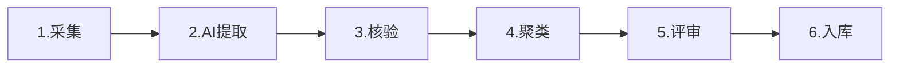

# 数据治理流程设计

## 数据资产总览

| 数据类型 | 规模 | 来源 |
|----------|------|------|
| 采购公告 | 76.34万条 | 自有+公开 |
| 采购合同 | 53.58万份 | 自有 |
| 标的信息 | 2万条 | 自有+第三方 |
| 法规文档 | 10万+ | 公开+第三方 |
| 质疑投诉案例 | 1万+ | 自有 |
| 供应商信息 | 10万+ | 自有+可信空间 |

## 四大数据渠道

### 1. 自有数据
- **来源**：政府采购中心历年业务系统数据
- **特点**：质量最高、结构化程度最好、可直接用于模型训练
- **内容**：采购公告、采购文件、评审报告、合同、质疑投诉处理记录
- **治理重点**：脱敏处理（去除供应商商业机密、个人信息）、结构化提取

### 2. 公开数据
- **来源**：全国公共资源交易平台、政府采购网、各地财政局公开数据
- **特点**：覆盖广、时效性强，但格式不统一、质量参差不齐
- **内容**：全国各地采购公告、中标结果、政策法规
- **治理重点**：格式标准化、去重、质量分级

### 3. 第三方数据
- **来源**：合作的数据服务商、行业协会、研究机构
- **特点**：专业领域深度数据，补充自有数据的盲区
- **内容**：行业价格基准、供应商信用数据、产品参数库
- **治理重点**：数据质量评估、授权合规性审查、更新频率管理

### 4. 可信空间数据
- **来源**：基于区块链的跨机构数据共享网络
- **特点**：数据不出域、可用不可见、确权可追溯
- **内容**：合作机构间共享的供应商信息、采购案例、风险预警
- **治理重点**：数据确权、使用审计、隐私计算（联邦学习/多方安全计算）

## 六大数据库

### 1. 政策法规库
- 国家/省/市各级政府采购法律法规、部门规章、规范性文件
- 法规间引用关系图谱（用于Neo4j知识图谱）
- 时效性标注（现行/已废止/已修订）

### 2. 历史采购文件库
- 历年采购文件（招标文件、谈判文件、询价文件等）
- 按品目、采购方式、预算规模分类
- 优质文件模板库（S/A级文件）

### 3. 项目案例库
- 完整采购项目案例（从需求调查到合同履约全流程）
- 典型案例标注（创新做法、质疑投诉处理、争议解决）
- 失败案例库（废标、投诉成立、行政处罚的原因分析）

### 4. 供应商库
- 供应商基本信息、资质信息、历史中标记录
- 供应商信用评级、履约评价
- 围串标风险关联图谱（用于风险预警）

### 5. 产品库
- 采购产品参数库、价格基准库
- 产品分类标准（与品目对应）
- 市场价格趋势数据

### 6. 质疑投诉案例库
- 质疑投诉函、答复函、处理决定
- 质疑投诉类型分类、胜诉/败诉分析
- 高频争议点统计（用于合规审查重点）

## 六环节标准化治理流程

### 环节1：采集
- 多渠道数据采集（API对接、爬虫、人工导入、可信空间共享）
- 采集时记录数据来源、采集时间、原始格式
- 原始数据存档，支持溯源

### 环节2：AI提取
- 用LLM+NER从非结构化文档中提取结构化字段
- 采购文件提取：项目名称、预算、品目、资质要求、评分标准、合同条款
- 公告提取：采购人、代理机构、中标供应商、中标金额、时间
- 提取结果带置信度，低置信度标记待人工核验

### 环节3：核验
- 规则校验：字段格式、必填项、数值范围、逻辑一致性
- 交叉验证：同一项目不同文档的信息一致性检查
- 人工抽检：AI提取结果的人工复核（抽检比例10%，低置信度100%复核）
- 错误反馈：核验发现的错误用于优化AI提取模型

### 环节4：聚类
- 文档去重：语义相似度聚类，去除重复/高度相似文档
- 品目聚类：按采购品目自动分类，修正人工分类错误
- 主题聚类：按项目主题、行业领域聚类，便于检索和分析
- 异常检测：聚类中的离群点标记为可疑数据（可能是错误或特殊案例）

### 环节5：评审
- 质量分级：S/A/B/C四级质量评定（基于完整性、准确性、规范性、时效性）
- 价值评估：数据对AI模型训练和业务应用的价值打分
- 敏感信息审查：个人信息、商业机密、国家秘密的识别与脱敏
- 合规审查：数据采集和使用是否符合《数据安全法》《个人信息保护法》

### 环节6：入库
- 通过评审的数据写入对应数据库
- 建立数据目录（元数据管理）：数据来源、质量等级、更新时间、使用权限
- 数据版本管理：每次更新保留历史版本，支持回滚
- 使用监控：记录数据被哪些Agent/模型调用，用于数据价值评估和权限审计

## 数据底座建设

平台数据底座建设是智能体精准运行的基础，已投入**240万元**用于数据治理，包括数据资产目录编制、数据库架构设计、脱敏规则梳理、数据分析系统的开发、数据抽提和标注。

### 专项品类数据采集

针对高频采购品类，开展专项数据采集，构建品类专属的价格基准库和产品参数库：

| 数据采集项目 | 开发方 | 阶段 | 说明 |
|-------------|--------|------|------|
| 医疗数据采集 | 沃云 | 数据采集 | 医疗设备、耗材品类的市场价格、供应商、产品参数数据 |
| IT设备数据采集 | 沃云 | 数据采集 | IT设备品类的市场价格、供应商、产品参数数据 |
| 家具数据采集 | 沃云 | 数据采集 | 家具品类的市场价格、供应商、产品参数数据 |

### 数据整理服务

| 项目 | 开发方 | 阶段 | 说明 |
|------|--------|------|------|
| 采购文件+质疑回复规则整理 | 南方、开普云 | 数据整理中 | 采购文件和质疑回复规则的清洗、结构化、标注，支撑合规检测和质疑回复智能体 |

### 三级价格对标体系

框采批采比价智能体构建"**央国采→典型省份→广东本地**"三级对标体系，为框架协议采购和批量集中采购提供价格监管支撑。

## 可信数据空间

### 区块链数据交换网络

建立可信数据共享中枢，基于区块链技术搭建智能体间数据交换网络：

- **数据确权**：每笔数据共享记录上链，明确数据所有权和使用权
- **可用不可见**：通过隐私计算（联邦学习/多方安全计算）实现数据共享但不泄露原始数据
- **跨域共享**：实现跨部门、跨领域数据的安全确权与按需共享
- **审计追溯**：所有数据访问和使用记录上链，支持溯源和合规审计
- **智能合约**：数据共享规则通过智能合约自动执行，保障各方权益

### 数据共享服务

平台可同时提供以下数据相关定制化服务：
- 数据治理服务
- 数据标注服务
- 多模态数据训练服务
- 数据资产管理服务

## 数据安全与合规

- **分级分类**：按数据敏感程度分为公开/内部/秘密/机密四级，不同级别对应不同的存储和访问控制
- **脱敏处理**：入库前对个人信息（身份证、电话、地址）、商业机密（报价、技术方案）做脱敏
- **访问控制**：基于角色的权限管理（RBAC），Agent调用数据需要明确授权
- **审计日志**：所有数据访问和修改记录日志，支持溯源和合规审计
- **本地化部署**：核心数据存储在私有化环境，不上公有云，符合信创要求
