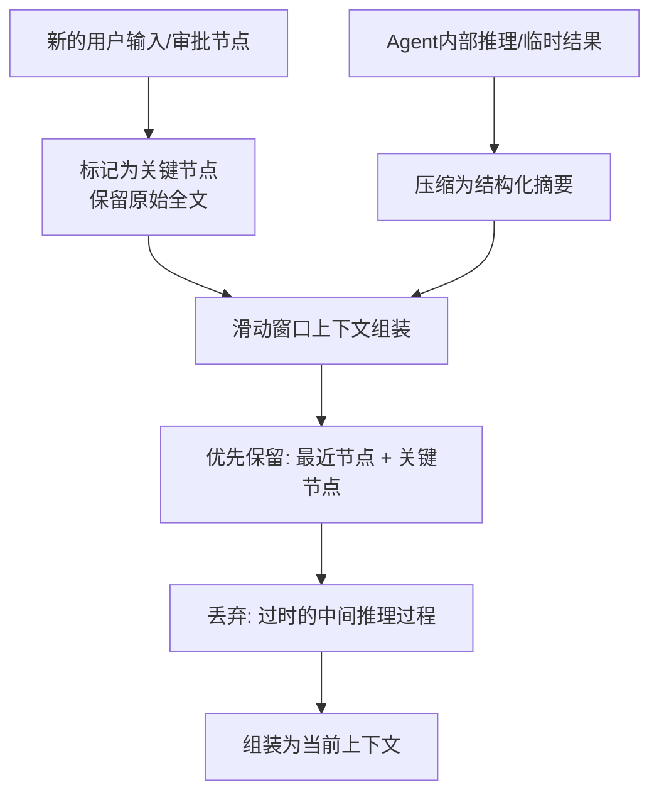

# 异常处理与长流程稳定性设计

## 核心挑战

多Agent长流程协作中，主要面临三类稳定性问题：

1. **上下文累积衰减**：流程越长，Agent需要处理的上下文越多，超出模型上下文窗口后指令遵循率急剧下降
2. **Agent间状态不同步**：多个Agent并行/串行执行时，状态更新延迟或丢失导致流程中断
3. **工具调用失败**：Function Call调用外部工具时超时、返回格式错误、数据异常等

## 上下文累积衰减问题

### 问题表现
采购文件全流程编制涉及10+轮Agent交互（需求分析→文件生成→合规审查→修改→复审→定稿），每轮都需要传递之前的所有上下文。当上下文超过32K时：
- 指令遵循率从95%降至70%
- 早期关键约束（如预算限额、特定资质要求）被"遗忘"
- 生成内容出现前后不一致

### 解决方案：分层摘要 + 滑动窗口



### 具体策略

1. **节点分级**：
   - **关键节点**（保留原始全文）：用户输入、人工审批结果、合规审查最终结论、用户修改指令
   - **普通节点**（压缩为摘要）：Agent内部推理过程、临时生成的中间结果、工具调用的详细返回

2. **摘要格式**：
   ```
   [节点类型] 文件生成Agent执行结果
   - 生成了XX章节，共XX字
   - 关键决策：采用了XX模板，因为XX
   - 待确认事项：XX条款需要人工确认
   - 引用法规：政府采购法第XX条
   ```

3. **滑动窗口**：
   - 窗口大小：控制在模型上下文的70%以内（如32K模型用22K）
   - 优先级：最近节点 > 关键节点 > 普通节点摘要
   - 超出窗口时，丢弃最旧的普通节点摘要

### 效果数据

| 指标 | 优化前 | 优化后 |
|------|--------|--------|
| 10+轮流程指令遵循率 | 70% | 88% |
| 平均延迟 | 基准 | +15%（摘要生成开销） |
| 关键约束遗忘率 | ~25% | < 5% |
| 长流程成功率 | ~75% | > 90% |

## Agent间状态同步

### 架构
- **共享状态存储**：Redis，所有Agent读写同一份状态
- **事件驱动消息总线**：Agent执行完后发布事件，下游Agent订阅事件触发执行
- **状态版本控制**：每次状态更新带版本号，冲突时以最新版本为准

### 状态结构
```python
{
    "task_id": "procurement-2026-001",
    "current_stage": "compliance_review",
    "shared_context": {
        "project_info": {...},
        "generated_docs": {...},
        "review_results": {...}
    },
    "agent_states": {
        "doc_generation": {"status": "completed", "output_ref": "..."},
        "compliance_review": {"status": "running", "started_at": "..."}
    },
    "checkpoints": [
        {"stage": "doc_generation", "state_snapshot": {...}, "timestamp": "..."}
    ]
}
```

## 工具调用失败处理

### 重试策略
- **幂等工具**（如查询、检索）：最多重试3次，指数退避（1s→2s→4s）
- **非幂等工具**（如写入、提交）：不自动重试，标记待人工确认

### 降级策略
- 工具调用失败时，Agent切换到备用方案（如RAG检索失败时，用关键词检索兜底）
- 多次失败后，流程暂停，通知人工介入

### 格式校验
- Function Call返回结果必须经过JSON Schema校验
- 校验失败时，让LLM重新解析或调用格式化工具
- 避免因返回格式错误导致整个流程崩溃

## 断点续跑

- 每个关键节点执行完后，保存完整状态快照到持久化存储
- 流程中断（系统崩溃、网络中断、人工暂停）后，可从最近的检查点恢复
- 恢复时重新加载状态快照，跳过已完成的节点，从断点继续执行
