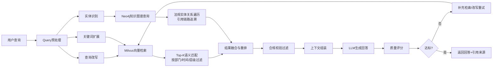

# Milvus+Neo4j双引擎RAG系统设计

## 为什么用双引擎

政府采购领域的RAG系统面临特殊挑战：

1. **专业术语多**：采购行业有大量专有术语，通用向量检索匹配效果差
2. **法规引用关系复杂**：下位法引用上位法、细则引用办法、地方规定引用国家规定，纯向量检索会丢失这种关系链路
3. **长尾问题多**：小众品目、特殊场景的问题在训练数据中很少见
4. **合规要求高**：回答必须有法规依据，不能有幻觉

**纯向量检索的不足**：能做语义匹配，但无法表达"法规A第3条引用了法规B第5条"这种关系，在合规溯源场景下不够。

**纯知识图谱的不足**：能表达实体关系，但无法处理自然语言语义相似度查询，且构建成本高。

**双引擎融合**：向量检索负责语义召回（广度），知识图谱负责关系推理与合规校验（精度），二者互补。

## 系统架构

## 核心流程详解

### 1. Query预处理

- **查询改写**：用LLM将用户口语化提问改写为标准检索查询（如"这个规定有没有说" → "政府采购法实施条例关于XX的规定"）
- **实体识别**：识别查询中的法规名称、条款号、品目名称、部门名称等实体
- **关键词扩展**：基于采购领域词典做同义词扩展（如"招投标" → "招标投标"、"采购文件" → "招标文件/谈判文件/询价文件"）

### 2. Milvus向量检索

- **索引类型**：HNSW（分层可导航小世界图），兼顾检索速度与精度
- **向量模型**：针对采购领域微调的Embedding模型（在10万+采购文档上继续预训练）
- **标量过滤**：支持按部门、时间范围、法规层级、文件类型等条件过滤
- **Top-K**：初始召回20条，后续重排后取Top-5

### 3. Neo4j知识图谱查询

- **实体类型**：法规、条款、品目、部门、采购方式、风险类型
- **关系类型**：引用、上位法/下位法、适用、禁止、鼓励、关联案例
- **查询方式**：
  - 从识别出的法规实体出发，遍历其引用链路（"这条规定引用了哪些上位法？"）
  - 从品目实体出发，查询适用的法规和历史案例
  - 风险规则推理："这个条款是否违反了上位法的某条规定？"

### 4. 结果融合与重排

- **向量分数**：Milvus返回的余弦相似度
- **图谱分数**：知识图谱中实体关系的匹配度（直接引用=1.0，间接引用=0.7，同层级=0.5）
- **融合公式**：`final_score = 0.6 * vector_score + 0.4 * graph_score`（权重可调）
- **去重**：同一法规的不同版本/不同引用路径去重，保留最高相关版本

### 5. 合规校验过滤

- 对召回的每条法规做时效性校验（是否已废止/修订）
- 对适用范围做校验（这条法规是否适用于当前项目类型/金额/地区）
- 过滤掉已失效、不适用的结果，避免LLM基于过时法规生成回答

### 6. LLM生成与质量评分

- 将过滤后的Top-5法规片段组装成上下文，连同用户查询一起发给LLM
- LLM生成回答时必须标注引用来源（[1][2][3]）
- 质量评分引擎对回答做合规性、完整性、引用准确性评分
- 评分不达标时触发补充检索或查询改写重试（最多2次）

## 评测体系

### 测试集构建
- 从历史采购文件、质疑投诉案例、政策咨询记录中分层抽样2000条
- 双人独立标注，不一致时由资深采购专家仲裁
- 覆盖XX类合规风险场景、XX类品目、XX种采购方式

### 评测指标
| 指标 | 数值 | 说明 |
|------|------|------|
| 精确率 | 98.5% | 检出的问题中真问题比例 |
| 召回率 | ~91% | 所有问题中检出比例 |
| F1 | ~94.6% | 精确率与召回率的调和平均 |
| 引用准确率 | ~96% | LLM标注的引用来源是否正确 |
| 幻觉率 | < 2% | 回答中编造法规/条款的比例 |

### 对比基线
| 方案 | 精确率 | 召回率 |
|------|--------|--------|
| 纯规则引擎 | ~24% | ~60% |
| 纯向量检索（通用Embedding） | ~72% | ~78% |
| 纯向量检索（领域微调Embedding） | ~88% | ~85% |
| **Milvus+Neo4j双引擎** | **98.5%** | **~91%** |

## 数据规模

| 数据 | 规模 |
|------|------|
| 法规文档 | 10万+ |
| 向量索引 | 100万+ chunk |
| 知识图谱实体 | 50万+ |
| 知识图谱关系 | 200万+ |
| 历史采购文件 | 53.58万份 |
| 采购公告 | 76.34万条 |
