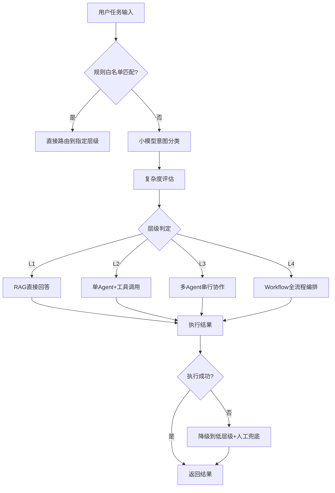

# L1-L4任务分层路由引擎设计

## 设计目标

在多Agent系统中，不同复杂度的任务需要不同的执行策略：
- 简单问答不需要启动多Agent协作，直接RAG回答即可
- 复杂全流程任务需要多Agent串行+人工审批节点
- 统一走最高层级会导致延迟高、成本高、失败率高
- 统一走最低层级无法处理复杂任务

因此设计L1-L4分层路由引擎，根据任务特征动态选择执行层级。

## 层级定义

### L1：单轮知识问答
- **特征**：用户单轮提问，答案可从知识库直接检索
- **执行**：Query改写 → RAG检索 → LLM生成回答
- **典型场景**："政府采购法第22条规定了什么？"、"这个品目的限额标准是多少？"
- **延迟目标**：< 3秒

### L2：单Agent+工具调用
- **特征**：需要调用1个或多个工具（Function Call）完成任务
- **执行**：意图识别 → 选择Agent → Agent调用工具 → 结果整合
- **典型场景**：合规检测（调用规则引擎+文档解析）、文件片段生成
- **延迟目标**：< 30秒

### L3：多Agent串行协作
- **特征**：任务有明确的步骤依赖，需要多个Agent按顺序执行
- **执行**：任务分解 → 依次调用各Agent → 中间结果传递 → 最终整合
- **典型场景**：采购文件编制（需求分析→文件生成→合规审查→修改）
- **延迟目标**：< 5分钟

### L4：全流程编排
- **特征**：涉及人工审批节点、跨系统对接、长周期任务
- **执行**：Workflow编排引擎 → 自动节点+人工节点混合 → 状态持久化 → 异常恢复
- **典型场景**：完整采购项目全流程（需求调查→文件编制→公告→评审→合同→履约）
- **延迟目标**：按天/小时级，支持中断恢复

## 路由策略

### 三因素评估

```
任务层级 = f(意图分类, 复杂度评估, 规则白名单)
```

1. **意图分类**：fine-tuned小模型（如Qwen-7B）对用户输入做意图分类，输出任务类型标签
2. **复杂度评估**：基于规则评估复杂度
   - 涉及工具数量（0个→L1，1-3个→L2，4个以上→L3）
   - 涉及文档数量（1份→L2，多份→L3）
   - 是否需要人工审批（是→L4）
   - 是否跨系统对接（是→L4）
3. **规则白名单**：高频固定任务直接路由到指定层级，跳过模型分类

### 路由决策流程



## 降级与异常处理

### 降级策略
- L4失败 → 降级到L3（跳过人工节点，标记待人工处理）
- L3失败 → 降级到L2（只执行核心步骤，其余标记待处理）
- L2失败 → 降级到L1（给出参考信息，建议人工处理）
- 所有降级都记录bad case，用于持续优化路由模型

### 状态同步
- 所有Agent共享状态存储（Redis），通过事件驱动消息总线同步
- 每个Agent执行完后更新共享状态，下游Agent读取最新状态
- 支持断点续跑：流程中断后从最近的检查点恢复

## 性能指标

| 指标 | 数值 |
|------|------|
| 日均调用量 | 万次级 |
| 路由准确率 | ~92%（基于人工抽检） |
| L1平均延迟 | < 3秒 |
| L2平均延迟 | < 30秒 |
| 降级触发率 | < 5% |
| 长流程成功率 | > 90% |
